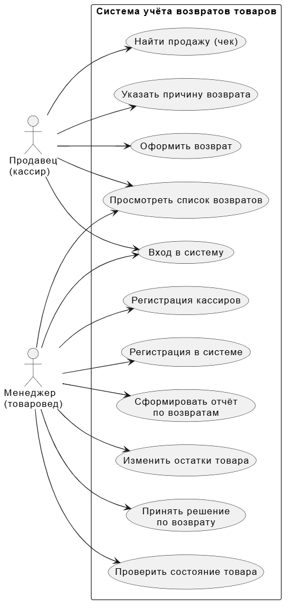
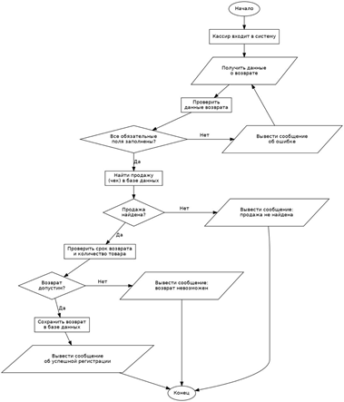
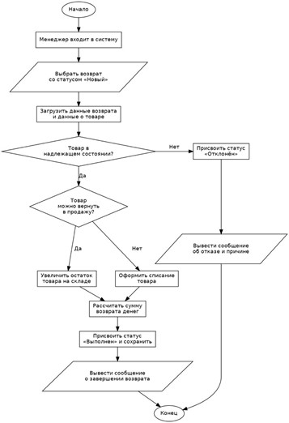

# Учет возвратов товаров

Программа для учёта возвратов товаров в магазине. Написана на **Python**.

## Основной функционал

**Продавец (кассир):**
- вход в систему;
- поиск продажи (чека);
- оформление возврата и указание причины;
- просмотр списка возвратов.

**Менеджер (товаровед):**
- регистрация в системе и регистрация кассиров;
- проверка состояния товара;
- принятие решения по возврату;
- изменение остатков товара;
- формирование отчёта по возвратам.

## Роли пользователей

| Роль | Основные действия |
|------|-------------------|
| Продавец (кассир) | Вход, поиск чека, оформление возврата, причина, список возвратов |
| Менеджер (товаровед) | Регистрация, проверка товара, решение по возврату, остатки, отчёты |

## Запуск

```bash
python src/main.py
```

## Структура проекта

- `src/` — исходный код
- `docs/diagrams/` — диаграммы PlantUML
- `docs/images/` — блок-схемы из лабораторной работы №1

## Диаграмма вариантов использования



## Информация из лабораторной работы №1

### Оформление возврата (кассир)

Кассир входит в систему, вводит данные о возврате, система проверяет заполнение обязательных полей, находит продажу по чеку, проверяет срок возврата и количество товара и сохраняет возврат.



### Обработка возврата (менеджер)

Менеджер выбирает возврат со статусом «Новый», проверяет состояние товара, при необходимости увеличивает остаток на складе или оформляет списание, рассчитывает сумму возврата и присваивает статус «Выполнен» либо «Отклонён».



Подробнее о Markdown: [документация GitHub](https://docs.github.com/ru/get-started/writing-on-github)

---
<!-- *Автор: Маштаков Никита Александрович, группа 26-ИВТ-2-1* -->